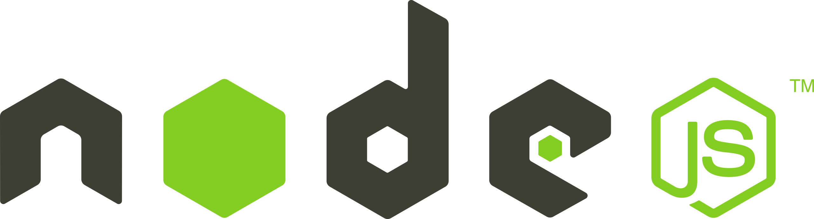

# Week 1 Recap

<h3 id="contents">Contents</h3>
<ol>
    <li>
        <a href="#intro">JavaScript - First steps</a>
        <ol>
         <li>
            <a href="#getting-started">Getting started</a>
         </li>
         <li>
            <a href="#what-is-js">What is JavaScript? High-level vs. low-level, dynamic typing etc.</a>
         </li>
        </ol>
    </li>
</ol>

<h2 id="intro"> JavaScript - First steps </h2>

```javascript
/**
 * Function to say hello!
 * @param { tutor, student } the tutor, and an array of students
 * @return {} nothing
 */
function helloClass(tutor, students) {
    for (student of students) {
        tutor.waveTo(student);
    }
    console.log("Hello!!");
}
```

**Welcome to JavaScript!**<br><br>
If this is your first time learning JS, not to worry, we'll be covering the language in detail and (hopefully) in a way that isn't too confusing ...

**This week's recap will assume that**:

-   You have done programming before, preferably in a low-level language such as C (those of you from UNSW will have taken COMP1511 and potentially COMP1521 / COMP2521 so no worries on that front)

<br>

<h3 id="getting-started"> Getting started </h3>

<br>

To run local JavaScript programs, you will need to have **Node.js** installed.
But what is 'Node.js'?

To put it simply (or not), **Node.js** is what we call a **runtime environment**. Essentially, it's what allows JavaScript to run outside of your browser (we will elaborate on this much later so don't worry about it :))

Feel free to set up however you like (using the tutorials on WebCMS), however I would definitely suggest that you work on everything **locally**. It is a bit more complicated at first but trust me it will save a lot of headache in the long run.

<br>



<br>

<h3 id="what-is-js"> What is JavaScript? </h3>

If this is your first time dealing with JavaScript, then don't worry! We'll cover everything there is to know about the language, what it is capable of, and include some real-world examples of how we might use it in our own personal projects!

So, **what is JavaScript**?

Although its name implies differently, JavaScript is not at all similar to **Java**. This will become painfully clear when you have to take COMP2511.

JavaScript is a **high-level**, **dynamically typed**, **Just-in-time (JIT) compiled** programming language. You might have heard of it alongside **HTML and CSS**, as one of the core programming languages to learn Web-development. In fact, according to [Wikipedia](https://en.wikipedia.org/wiki/JavaScript), it is used in 98.9% of websites!

But what do those terms actually mean?

<br>

-   **High-level**: A language is considered 'high-level' if it contains a high amount of **abstraction** from what the computer does behind the scenes. This generally means that the code tends to be more readable and resembles **Human** instructions a lot more. Things like memory management are what you would see in a low-level language. **C** is an example of a **low-level** language.

    -   **Advantages**: High-level programming languages are often a lot easier to write with, read and can be used to easily create extremely complex programs.
    -   **Disadvantages**: Because a lot of the stuff you write is not micro-managed, high-level languages often lack execution speed.

-   The two code snippets below do the same thing:

```C
// Sorting an Array in C - LOW LEVEL
// Credit: https://www.geeksforgeeks.org/bubble-sort/

void swap(int* xp, int* yp) {
    int temp = *xp;
    *xp = *yp;
    *yp = temp;
}

// An optimized version of the bubble sort algorithm
void sort(int arr[], int n) {
    int i, j;
    bool swapped;
    for (i = 0; i < n - 1; i++) {
        swapped = false;
        for (j = 0; j < n - i - 1; j++) {
            if (arr[j] > arr[j + 1]) {
                swap(&arr[j], &arr[j + 1]);
                swapped = true;
            }
        }
        if (!swapped)
            break;
    }
}

int main(void) {
    int arr[] = { 64, 34, 25, 12, 22, 11, 90 };
    int n = sizeof(arr) / sizeof(arr[0]);
    sort(arr, n);
    return 0;
}
```

```javascript
// Sorting an array in JS - HIGH LEVEL
const arr = [64, 34, 25, 12, 22, 11, 90];
arr.sort((a, b) => a - b);
```

(Advanced) As it turns out, these two are actually _not_ the same. For those familiar with Big O notation (in 2521), JS sorts with an **O(nlogn)** algorithm whereas the algorithm in the C snippet is **O(n^2)**.

Moving on...

<br>

-   **Dynamically typed**: As opposed to **statically-typed**, dynamically typed languages don't require us to specify types when we write programs. The program instead **infers** the type **at runtime** (ie. when the program actually executes)
    -   **Advantages**: Makes it less tedious to micro-manage and ensure type-safety for every variable in the program.
    -   **Disadvantages**: This does make the program more prone to bugs, however.
